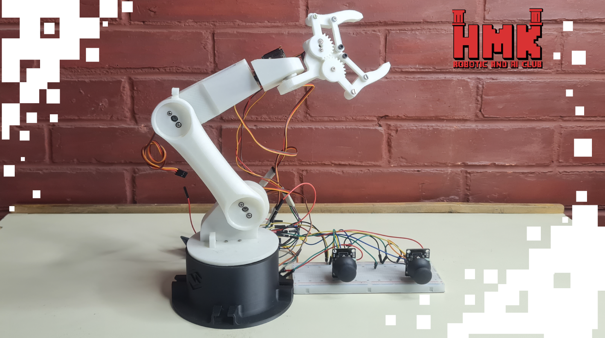

# 🤖 Joystick-Controlled Robotic Arm

## 📅 Project Timeline & Context

- **Event:** FMEE 2025 – **AI & Robotics Club** Open Day
- **Date:** November 10–11–12, 2025

---

---

## 💡 Project Overview

A simple and intuitive robotic arm controlled using **two Arduino joysticks**.  
The system uses **four servo motors** to provide full movement:  
- One servo for the **base rotation**  
- Two servos for the **arm joints**  
- One servo for the **end effector/gripper**

This setup allows smooth, manual control and is ideal for learning robotics, kinematics, and Arduino-based motion control.

This project demonstrates how a robotic arm can be manually controlled using two analog joysticks connected to an Arduino Uno.  
Each joystick axis corresponds to a different servo, giving users direct and natural control over the arm's movements.  

The system is designed to be:  
- Easy to operate  
- Highly responsive  
- Beginner-friendly for robotics and electronics learners  

The Arduino reads joystick input values, maps them to servo angles, and drives the robotic arm in real time.

---

## ⚙️ Components and Parts Used

### 🛠 Hardware
- 🧠 **Arduino Uno** – main controller  
- 🔧 **4× Servo Motors**  
  - 1x Base rotation servo  
  - 2x Joint servos  
  - 1x End-effector/gripper servo  
- 🎮 **2× Analog Joysticks** – for manual control  
- 🟦 **Servo Controller / Power Module** – stable power delivery for servos  
- 🔌 Jumper wires, breadboards, and connectors  
- ⚙️ Robotic arm frame (3D-printed)  

---

## 💻 Software and Tools Used
- 🔧 **Arduino IDE** – for coding and uploading the control program  
- 📚 **Servo Library** – for precise servo motor control  
- 🧪 Serial Monitor  – for debugging joystick values  

---

## 👨‍💻 Contributors:

- **Ayman Bakleh** [LinkedIn](https://www.linkedin.com/in/aymanbakleh/)

---

## 🚀 Future Improvements
- Add automatic / autonomous movement sequences  
- Implement inverse kinematics for smoother control  
- Add limit switches to prevent over-rotation  
- Include OLED or LCD for status display  
- Control via Bluetooth or Wi-Fi instead of joysticks  
- Add stronger servos for larger payloads  

---

## 📸 Demo

**Coming soon!**

---

Made with ❤️ using Arduino, servos, and hands-on creativity.
